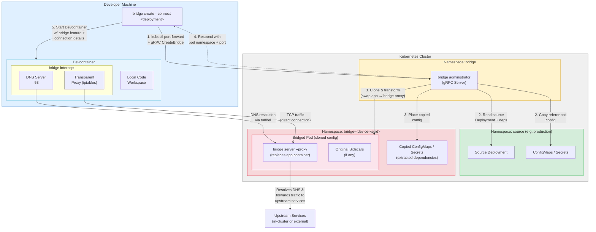

# Implement Bridge for Kubernetes Plan

Read the [architecture](./architecture.md) doc prior to implementing this plan to get more context.

# Goal

The goal of bridge in Kubernetes is to implement a flow where a developer is able to run the
`bridge create --connect <deployment name>` command.

This command will provision a bridge proxy server using the exact same source configuration, but swapping out the
application container with a proxy container which ultimately is just running the `bridge server --proxy` command. A
Devcontainer will start on the developer's machine which will have `bridge intercept` running like in Vercel but, rather
than going through a Sandbox tunnel, it will just connect directly to the bridge server thus saving a hop.

# Requirements

Things that need to get done. FYI this needs to target the K8s API server of 1.29.

## Create a `bridge administrator` command

This command will start an "administrator" server which will be responsible for creating and cleaning up any "bridges"
it creates. The flow for creating a bridge will be:

1. Create a namespace for the resources to run in (if it doesn't already exist). The namespace must be labeled with
   `bridge.dev/managed-by: administrator` so the Administrator can track all namespaces it owns (e.g. for listing
   active bridges and cleanup).
2. Create RBAC resources (Role + RoleBinding) granting the Administrator's ServiceAccount full control over the new
   namespace. This ensures the Administrator can create, update, and delete any resource within it without requiring
   cluster-wide admin privileges.
3. Copy the source of the configuration.
4. Perform any transforms, including swapping the application container for the `bridge proxy`.
5. Place all transformed K8s resources into the newly created namespace.

### Copying sources

Deployments will often require configuration e.g. ConfigMaps or Secrets to run properly. The sourcer for this config
should look at all of these references and extract them from the source. For example, if a Deployment needs a Secret key
for an env var or volume mount, it should copy that key into a single Secret that will be placed into the target
namespace. Same goes for all configuration. Basically like extracting all "dependencies" and copying them over into the
target namespace.

### gRPC API

The `bridge create` command will ultimately connect to the Administrator server running in the `bridge` namespace and
send a `CreateBridge` unary gRPC message which includes all the needed information. The Administrator will respond with
the pod namespace and port to connect to once the pod is up and all containers are running.

The Administrator must expose three unary RPCs:

1. **`CreateBridge`** — Provisions a new bridge (or replaces an existing one for the same device + deployment).
   The request includes the device ID, source deployment name/namespace, and any options. The Administrator uses the
   device ID to deterministically name the target namespace `bridge-<device-id>`. If a bridge for the same deployment
   already exists in that namespace, the Administrator should tear it down and recreate it (the client is responsible
   for confirming with the user before sending the call — see `bridge create` section below).
2. **`ListBridges`** — Returns all bridges currently managed by the Administrator. The Administrator queries for all
   namespaces labeled `bridge.dev/managed-by: administrator` and returns their metadata (device ID, source deployment,
   creation time, status, etc.). Can optionally be filtered by device ID.
3. **`DeleteBridge`** — Tears down a specific bridge. The Administrator deletes all resources in the target namespace
   and then deletes the namespace itself. Identified by device ID + deployment name (or namespace name directly).

### RBAC & Namespace Labeling

The Administrator itself should run with a ClusterRole that allows it to:
- Create and delete namespaces
- Create Role/RoleBinding resources in any namespace it creates

When a bridge namespace is created, the Administrator should:
1. Label the namespace with `bridge.dev/managed-by: administrator`, `bridge.dev/device-id: <ksuid>`,
   and optionally `bridge.dev/source-deployment` and `bridge.dev/created-by` for auditability.
2. Create a Role in the new namespace granting full access (`*` verbs on `*` resources in `*` apiGroups).
3. Create a RoleBinding binding that Role to the Administrator's ServiceAccount.

This scoped approach means the Administrator only needs cluster-level permissions for namespace and RBAC management,
while all resource manipulation within bridge namespaces is authorized via the per-namespace Role.

### Tasks

* Create a generic package for copying and transforming a batch of k8s config
* Create a generic package for establishing a `kubectl port-forward` to the Administrator to create the Bridge. This
  should not just call `kubectl`, it should actually connect to the API server.
* A package that can follow the "dependency" graph of a deployment and utilize that information to extract the exact
  values needed.
* A GHA that pushes a Docker image of the `bridge administrator` command to run in a cluster.
* Create the gRPC API and service definition (`CreateBridge`, `ListBridges`, `DeleteBridge`)
* Create the ClusterRole, ClusterRoleBinding, and ServiceAccount manifests for the Administrator
* Implement namespace labeling (`bridge.dev/managed-by: administrator`, `bridge.dev/device-id`, etc.) and
  per-namespace RBAC (Role + RoleBinding) creation as part of the bridge provisioning flow
* Implement `ListBridges` by querying namespaces with the `bridge.dev/managed-by: administrator` label
* Implement `DeleteBridge` to tear down all resources in the target namespace and delete the namespace

## Proxy gRPC Service

When running as `bridge server --proxy`, the bridge server should run as a gRPC service instead of the default
WebSocket-based service. This is the mode used by the proxy container that replaces the application container in the
bridged pod.

The key difference from the WebSocket approach is that each operation is a discrete gRPC call rather than multiplexing
everything over a single WebSocket pipe. This gives us proper request/response semantics, built-in error handling per
call, and makes the proxy service easier to reason about.

### RPCs

1. **`ResolveDNSQuery`** (unary) — Resolves a DNS query on behalf of the intercepting client. The bridge intercept
   running in the devcontainer sends DNS queries to the proxy, which resolves them against the cluster's DNS (e.g.
   CoreDNS). This replaces the DNS resolution messages that were previously sent over the WebSocket tunnel.
2. **`TunnelNetwork`** (bidirectional streaming) — Tunnels network traffic (TCP or UDP) to an upstream service. The
   client opens a stream, sends the target host, port, and protocol, and then both sides exchange data frames until
   the connection is closed. This replaces the data frames that were previously multiplexed over the WebSocket.

### Tasks

* Define the `BridgeProxyService` proto with `ResolveDNSQuery` and `TunnelNetwork` RPCs
* Implement the gRPC server in the `bridge server --proxy` code path
* Update `bridge intercept` to use the gRPC client when connecting to a proxy (vs WebSocket for Vercel tunnels)

## Create a `bridge create --connect` command

This command will be what the Developers/agents use on their machines. The command should:

1. **Resolve device identity**: Read the device ID from `~/.bridge/device-id.txt`. This file is guaranteed to exist
   because device ID generation happens on the first invocation of any `bridge` command (see Device Identity below).
   The ID is sent with every `CreateBridge` call so the Administrator can deterministically name the namespace
   `bridge-<device-id>`.
2. **Check for existing bridge**: Before sending `CreateBridge`, send a `ListBridges` call filtered by the device ID.
   If a bridge already exists for the same deployment, print a warning to the user explaining that the existing bridge
   will be torn down and recreated, and require confirmation (e.g. `y/N` prompt) before proceeding. If the user
   declines, abort.
3. Send a `CreateBridge` unary gRPC message to the Administrator (including the device ID).
4. If the developer specifies an argument, it is assumed to be the name of a Deployment. If nothing is specified, the
   `administrator` should just create a simple Deployment with the `bridge proxy` container in the target namespace.
5. The Administrator responds with the connection details.
6. A copy of the source Devcontainer is created under `.devcontainer/bridge-<deployment name>/devcontainer.json` which
   has the `bridge` Devcontainer feature injected with the connection details passed in as options. By default,
   `forward-domains` is set to all domains.
7. **This is where the `--connect` flag kicks in**: `bridge` starts the Devcontainer and places the user inside it
8. The `bridge` Devcontainer feature detects the connection details and runs `bridge intercept` to forward/intercept
   network traffic. If it's unable to connect, it should print to the user that something is not working properly and
   print out an error. If the issue is recoverable, it should attempt to reconnect, otherwise, it should cause the
   container to exit.

### Device Identity

Each developer machine is identified by a KSUID stored in `~/.bridge/device-id.txt`. This file contains only the
raw KSUID string (e.g. `1srOrx2ZWZBpBUvZwXKQmoEYga2`). The ID is:

- **Generated once** on the first invocation of **any** `bridge` command (not just `bridge create`). If
  `~/.bridge/device-id.txt` does not exist, the CLI generates a new
  [KSUID](https://github.com/segmentio/ksuid), creates the `~/.bridge` directory if needed, writes the ID to the
  file, and proceeds. This should be implemented as early CLI middleware so every command can assume the file exists.
- **Sent with `CreateBridge`** so the Administrator names the namespace `bridge-<device-id>`, giving each device a
  consistent, dedicated namespace.
- **Used for conflict detection** — before creating a bridge, the client calls `ListBridges` filtered by device ID to
  check if a bridge for the same deployment already exists and warns the user accordingly.
